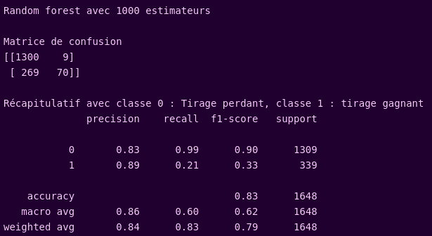

# Euromillions

## Choix techniques et installation

### Choix techniques

Aucun gros choix technique n'a été réalisé. Nous avons choisis de séparer les différentes routes et le modèle pour une meilleure lisibilité.

### Installation

Créer et se placer dans son environnement virtuel

installer :

pip install "fastapi[all]"

pip install pandas

pip install scikit-learn

se placer dans le main et lancer un serveur local :

uvicorn main:app --reload

Aller sur l'adresse locale indiquée et ajouter /docs

## Présentation du modèle

### Etude de la donnée

Initialement, la donnée se présente sous forme de 1318 tirages d'Euro Millions de 5 numéros entre 1 et 50 et de deux numéros étoile entre 1 et 12. Les tirages ont été effectués entre le 10 janvier 2004 et le 1er décembre 2021. Pour chaque tirage est indiqué le nombre de gagnants et la somme mise en jeu.

Une étude de la moyenne des gains par mois au fil des années pour dégager une tendance à propos de la date a été effectuée mais sans résulats concluants.

Les tirages étant totalement indépendants et aléatoires, nous pourrions nous attendre à des moyennes, médianes et écart-types très imilaires entre les différents numéros. Cependant, on observe une variation de +-10% et +-15% autour de la moyenne et de la médiane attendues de 25.5 et il en va de même pour les numéros étoile.

Nous avions initialement décidé de choisir comme variable cible pour nos modèles le ratio entre le gain et le nombre de gagnants +1. En effet, cela permettait d'avoir le montant exact remporté en cas de victoire. Cependant, il nous est apparu qu'il est plus pertient de considérer comme variable cible le fait qu'une grille soit gagnate ou pas, sans considérer l'argent récompense ou encore si la grille avait été gagnée. Notre nombre de données d'apprentissage étant d'ores et déjà relativement faible, choisir un modèle de régression plutôt qu'un modèle de classification binaire n'aurait qu'heurté la qualité de notre modèle.

### Construction du modèle

Nous avons généré pour chaque tirage gagnant de nos données 4 tirages perdants composés d'entiers aléatoires dont au moins un est différent de la grille gagnante. Nous avons ainsi un jeu de données composé de 80% de tirages perdants pour 20% de tirages gagnants. Nous avons ensuite entrainé un modèle de forêt aléatoire sur un jeu d'apprentissage composé de 75% des données. Nous avons choisi le modèle de RandomForest grâce à sa grande robustesse et simplicité de paramétrisation. Un test rapide avec d'autres modèles a donné un résultat inférieur. Le nombre d'estimateurs de la forêt aléatoire a été fixé à 1000 pour une meilleure qualité de modèle.

### Résultats

Les tirages étant aléatoires et indépendants, il devrait être impossible de fournir un modèle de prédiction pour gagner à l'Euro Millions. Cepandant, nous atteignons un rappel de 0.21 au lieu de 0 si les tirages étaient réellement aléatoires et indépendants. Ainsi, même si notre précision n'est pas idéale, nous avons mis en évidence que les tirages gagnants sont en partie prévisibles. Il ne faut cependant pas oublier que notre répartition de données d'apprentissage 80/20 est très loin des nombres réels de grilles gagnantes et perdantes et que ceci a forcément eu de l'impact sur les résultats.
